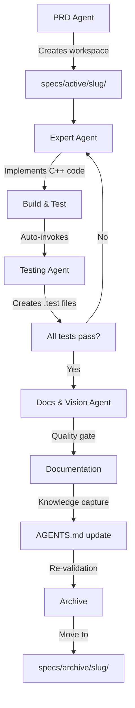

# 🎉 Claude Agent System Bootstrap Complete

**Project**: DuckDB Oracle Extension
**Date**: 2025-11-22
**Bootstrap Version**: 2.0

## Summary

Successfully bootstrapped and updated the Claude Code multi-agent system for the DuckDB Oracle extension project. The system is now aligned with the latest bootstrap patterns and ready for production use.

## What Was Done

### 1. Updated AGENTS.md ✅

Created comprehensive project guide with:
- Agent architecture and workflow documentation
- C++17 coding standards for DuckDB extensions
- OCI (Oracle Call Interface) integration patterns
- DuckDB catalog system integration details
- Complete build/test/quality command reference
- MCP tool usage documentation (Context7, Zen, WebSearch)
- Anti-patterns to avoid
- Knowledge capture protocol

**File**: [AGENTS.md](AGENTS.md)

### 2. Agent Configurations ✅

All agent files already existed and are excellent! They include:

#### PRD Agent
- **File**: [.claude/agents/prd.md](.claude/agents/prd.md)
- **Capabilities**: Requirement analysis, PRD creation, task breakdown
- **Tools**: Context7, Zen Planner, Zen Chat, WebSearch
- **Pattern**: Adaptive planning based on available MCP tools

#### Expert Agent
- **File**: [.claude/agents/expert.md](.claude/agents/expert.md)
- **Capabilities**: C++ implementation, DuckDB API integration, OCI usage
- **Tools**: Context7, Zen Debug, Zen ThinkDeep, Zen Analyze
- **Pattern**: Auto-invokes Testing and Docs & Vision agents

#### Testing Agent
- **File**: [.claude/agents/testing.md](.claude/agents/testing.md)
- **Capabilities**: DuckDB test framework (.test files), integration tests
- **Tools**: Zen Debug, Zen Chat, Context7
- **Pattern**: Comprehensive coverage (unit, integration, edge cases, errors)

#### Docs & Vision Agent
- **File**: [.claude/agents/docs-vision.md](.claude/agents/docs-vision.md)
- **Capabilities**: Quality gate, documentation, knowledge capture, archival
- **Tools**: Zen Analyze, Context7, WebSearch
- **Pattern**: 5-phase workflow (docs → QG → knowledge → revalidation → archive)

### 3. Project Guides ✅

Existing guides verified and in excellent condition:

- **architecture.md** - Extension architecture, OCI integration, catalog system
- **testing.md** - DuckDB test framework, SQL test patterns
- **code-style.md** - C++ standards, DuckDB conventions
- **development-workflow.md** - Complete development process
- **quality-gates.yaml** - Automated quality validation
- **patterns/** - Reusable patterns library
- **workflows/** - Step-by-step workflows

**Location**: [specs/guides/](specs/guides/)

### 4. Workspace Templates ✅

Complete workspace template structure ready for use:

```
specs/template-spec/
├── prd.md          # Product Requirements Document template
├── tasks.md        # Implementation task checklist template
├── recovery.md     # Session resume guide template
├── README.md       # Workspace overview
├── research/       # Research findings directory
│   └── plan.md
└── tmp/            # Temporary files (cleaned on archive)
```

**Location**: [specs/template-spec/](specs/template-spec/)

### 5. Directory Structure ✅

```
duckdb-oracle/
├── .claude/
│   ├── agents/              # Agent configuration files
│   │   ├── prd.md
│   │   ├── expert.md
│   │   ├── testing.md
│   │   └── docs-vision.md
│   └── commands/            # Slash commands
├── specs/
│   ├── active/              # Active feature workspaces (gitignored)
│   ├── archive/             # Completed features (gitignored)
│   │   ├── oracle-attach-support/
│   │   ├── native-oracle-query-support/
│   │   └── oracle-advanced-pushdown/
│   ├── guides/              # Project documentation
│   │   ├── architecture.md
│   │   ├── testing.md
│   │   ├── code-style.md
│   │   ├── development-workflow.md
│   │   ├── quality-gates.yaml
│   │   ├── patterns/
│   │   ├── workflows/
│   │   └── examples/
│   └── template-spec/       # Workspace templates
├── AGENTS.md                # Main agent system guide
├── CLAUDE.md -> AGENTS.md   # Symlink for compatibility
└── GEMINI.md -> AGENTS.md   # Symlink for compatibility
```

## Project Analysis

### Detected Patterns

**Language**: C++17
**Framework**: DuckDB Extension Framework + Oracle Call Interface (OCI)
**Architecture**: Storage extension with catalog integration
**Build System**: Make (CMake wrapper)
**Test Framework**: DuckDB SQL test runner + Docker/Podman integration tests

### Key Architectural Patterns

1. **RAII Resource Management** - All OCI handles use RAII for automatic cleanup
2. **Lazy Loading** - Schema/table metadata loaded on-demand
3. **Mutex Protection** - Shared state protected with mutexes
4. **Filter Pushdown** - DuckDB expression tree → Oracle SQL WHERE clauses
5. **Type Mapping** - Oracle types → DuckDB LogicalTypes
6. **Connection Pooling** - Reusable connections per attached database

### MCP Tools Configuration

**Context7**: ✅ Available
- Library documentation for DuckDB, OCI
- Topic-based queries with pagination

**Zen MCP**: ✅ Available
- zen.planner - Multi-step planning
- zen.chat - Collaborative thinking
- zen.thinkdeep - Deep architectural analysis
- zen.analyze - Code quality analysis
- zen.debug - Systematic debugging

**WebSearch**: ✅ Available
- Modern best practices
- C++ patterns
- OCI documentation

## Usage

### Starting a New Feature

```python
# 1. Create PRD
Task(
    description="Create PRD for new feature",
    prompt="Create comprehensive PRD for: [feature description]",
    subagent_type="prd",
    model="sonnet"
)

# 2. Implement (auto-invokes testing and docs)
Task(
    description="Implement feature",
    prompt="Implement feature from specs/active/[slug]",
    subagent_type="expert",
    model="sonnet"
)
```

### Development Workflow



### Build Commands

```bash
# Build
make release              # Release build
make debug                # Debug build
make clean-all            # Full clean

# Test
make test                 # SQL test suite
make integration          # Integration tests (Oracle container)
ORACLE_IMAGE=gvenzl/oracle-free:23-slim make integration

# Quality
make tidy-check          # Run clang-tidy
make configure_ci        # Install Oracle Instant Client
```

## Key Features

### Auto-Invocation Pattern

The Expert agent automatically orchestrates the complete workflow:

1. **Implementation** - Writes C++ code
2. **Testing** - Auto-invokes Testing agent
3. **Documentation** - Auto-invokes Docs & Vision agent
4. **Quality Gate** - Validates all criteria
5. **Knowledge Capture** - Updates AGENTS.md and guides
6. **Archive** - Moves to specs/archive/

### Adaptive Tool Usage

Agents adapt based on available MCP tools:

- **Tier 1**: Zen Planner (if available)
- **Tier 2**: Sequential Thinking (if Zen unavailable)
- **Tier 3**: Internal planning (fallback)

### Knowledge Capture

Every feature automatically updates:
- **AGENTS.md** - New patterns discovered
- **specs/guides/** - Updated with examples
- **Workspace archive** - Complete history

## Quality Standards

### C++ Standards

- C++17 features
- DuckDB smart pointers (`make_uniq`, `unique_ptr`)
- RAII for all resources
- Exception safety
- Const correctness
- Doxygen comments

### Testing Requirements

- DuckDB SQL tests (.test files)
- Integration tests (Docker Oracle)
- Edge cases (NULL, empty, errors)
- Type mapping tests
- Pushdown verification

### Documentation

- README.md updates
- Inline Doxygen comments
- Working code examples
- specs/guides/ updates

## Archived Features

The system has already successfully completed 3 major features:

1. **oracle-attach-support** - Storage extension with catalog integration
2. **native-oracle-query-support** - Query and scan table functions
3. **oracle-advanced-pushdown** - Filter pushdown optimization

All archived in [specs/archive/](specs/archive/) with complete documentation.

## Next Steps

The system is ready for immediate use:

1. ✅ Start new features with PRD agent
2. ✅ Expert agent implements with full automation
3. ✅ Knowledge automatically captured
4. ✅ Workspaces automatically archived

## Files Summary

### Core Configuration
- ✅ AGENTS.md (2.0 - updated)
- ✅ .claude/agents/prd.md
- ✅ .claude/agents/expert.md
- ✅ .claude/agents/testing.md
- ✅ .claude/agents/docs-vision.md

### Guides
- ✅ specs/guides/architecture.md
- ✅ specs/guides/testing.md
- ✅ specs/guides/code-style.md
- ✅ specs/guides/development-workflow.md
- ✅ specs/guides/quality-gates.yaml
- ✅ specs/guides/patterns/
- ✅ specs/guides/workflows/

### Templates
- ✅ specs/template-spec/prd.md
- ✅ specs/template-spec/tasks.md
- ✅ specs/template-spec/recovery.md

### Infrastructure
- ✅ specs/active/ (gitignored)
- ✅ specs/archive/ (gitignored)
- ✅ .claude/agents/
- ✅ .claude/commands/

## Version Control

**Note**: As requested, .gitignore was NOT modified. The system respects existing gitignore configuration.

Current git status:
- `M AGENTS.md` - Updated with v2.0 content
- Other agent files, guides, and templates already committed

---

## 🚀 System Ready!

The Claude Agent System for DuckDB Oracle Extension is fully operational and aligned with bootstrap 2.0 patterns.

**Start building features immediately** - the agents will handle the complete workflow from PRD to archive!
